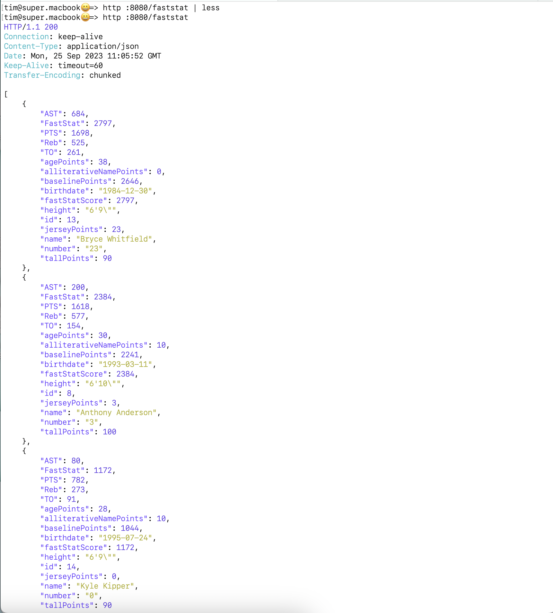

# FastStatAPI

FastStatAPI

## building and running the app

build:
```
git clone https://github.com/timxor/FastStatAPI.git
cd FastStatAPI/faststat-api
mvn clean package
```

run the app:
```
# ls -lb target/*.jar
java -jar target/FastStatAPI-0.0.1-SNAPSHOT.jar
```

open the browser or query the api from terminal:

```
curl http://localhost:8080/faststat | jq | less

http://localhost:8080/faststat
```

#### input file

the [sample.json](./faststat-api/src/main/resources/static/sample.json) input file is used to seed the responses.

it's located here:

```/FastStatAPI/faststat-api/src/main/resources/static/sample.json```

[./faststat-api/src/main/resources/static/sample.json](./faststat-api/src/main/resources/static/sample.json)

## API endpoints


### endpoint 1:

with jq pretty print:
```
curl http://localhost:8080/faststat | jq | less
```

or with curl:
```
curl http://localhost:8080/faststat
```





### endpoint 2


## java, springboot and maven version

Confirm you have java and maven installed.


#### Install and set default java version to 17:

```
sdk list java
sdk install java 17.0.8-graalce
sdk use java 17.0.8-graalce 
sdk default 17.0.8-graalce
```

confirm java 17 is the current version:
```
java -version
```


#### install springboot

```
sdk install springboot
```


#### install maven

```
brew install maven
```

confirm maven is installed:

```
mvn -v
```


